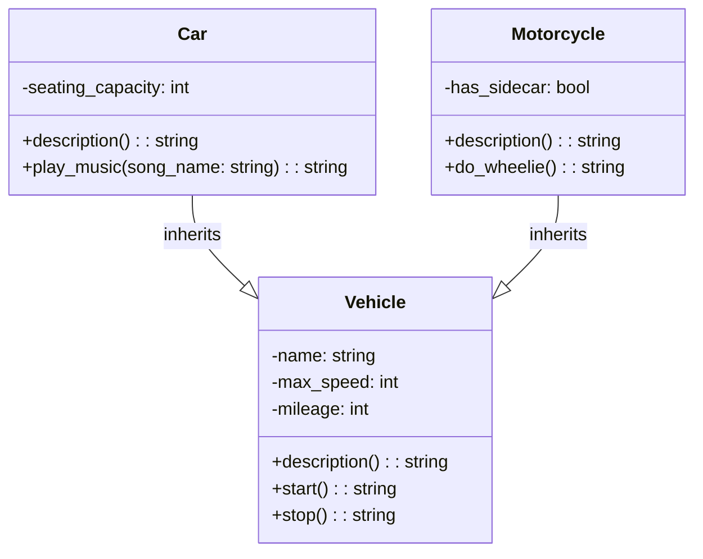

# This is a readme.md

___
## This is a Class Diagram made by Mermaid-js

```mermaid
classDiagram
    class Vehicle {
        -name: string
        -max_speed: int
        -mileage: int
        +description(): string
        +start(): string
        +stop(): string
    }
    class Car {
        -seating_capacity: int
        +description(): string
        +play_music(song_name: string): string
    }
    class Motorcycle {
        -has_sidecar: bool
        +description(): string
        +do_wheelie(): string
    }
    Car --|> Vehicle : inherits
    Motorcycle --|> Vehicle : inherits
```
